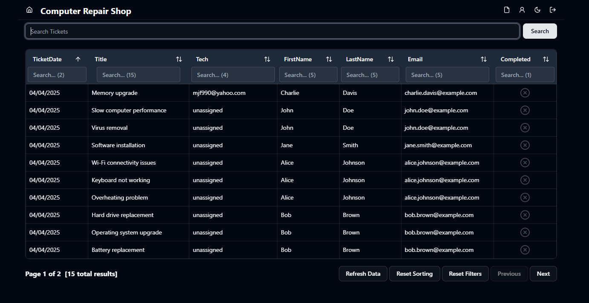
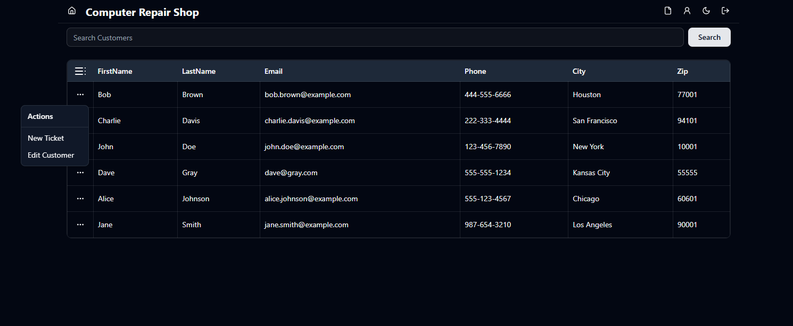
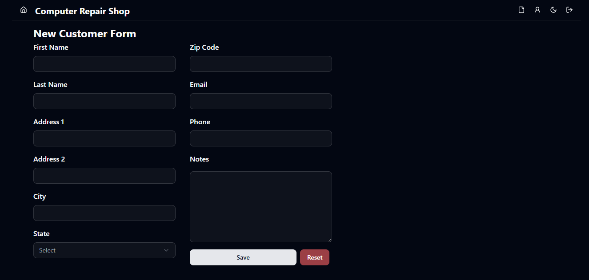
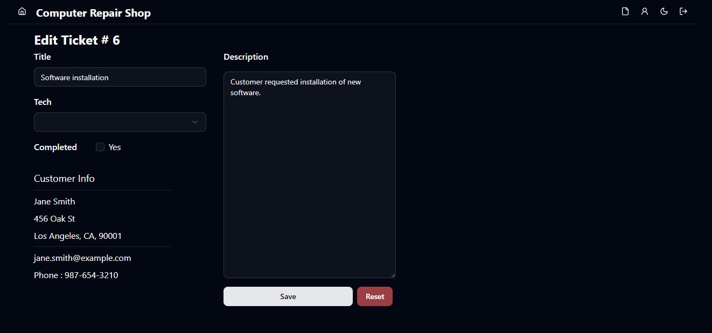

# 🛠️ RepairShop — Ticketing System for Computer Repair Management


---

## 💡 About the Project

**RepairShop** is a full-stack ticketing platform designed for computer repair shops to manage customer service requests and employee task allocation more efficiently.

Whether it’s a simple software fix or a hardware replacement, this system keeps track of:
- 🧾 **Customer tickets**
- 👨‍🔧 **Assigned employees**
- ⏱️ **Repair timelines**
- 📦 **Service status and documentation**

The goal is to replace manual tracking and fragmented communication with a centralized, secure, and beautiful web-based solution.

---

## 🚀 Tech Stack

| Category           | Tech                                                                 |
|--------------------|----------------------------------------------------------------------|
| **Frontend**       | [Next.js 15](https://nextjs.org), [TypeScript](https://www.typescriptlang.org), [Tailwind CSS](https://tailwindcss.com), [ShadCN/UI](https://ui.shadcn.com), [React Hook Form](https://react-hook-form.com), [Radix UI](https://www.radix-ui.com/) |
| **Backend**        | Next.js API Routes, [Drizzle ORM](https://orm.drizzle.team), [Zod](https://zod.dev) |
| **Database**       | [Neon Postgres](https://neon.tech) |
| **Auth**           | [Kinde Auth](https://kinde.com) |
| **Monitoring**     | [Sentry](https://sentry.io) |
| **Tooling & DX**   | ESLint, Prettier, TypeScript strict mode, Tailwind Plugins (Merge, Animate) |

---

## 📸 Screenshots

### 🧾 Tickets Table  


### 👨‍💼 Customers Table  


### 🧾👨‍💼 Customers Form  


### 🧾👨‍💻 Edit A Ticket  



---

## 📦 Getting Started

```bash
# Clone the repo
git clone https://github.com/your-username/repairshop.git
cd repairshop

# Install dependencies
npm install

# Create .env file
cp .env.example .env

# Run dev server
npm run dev
```

💡 Make sure you configure **Kinde**, **Neon**, and **Sentry** credentials in your `.env` file.

---

## 🧱 Folder Structure

```bash
/app            # Next.js App Router pages
/components     # UI Components (ShadCN-based)
/db             # Drizzle schemas and queries
/lib            # Utility functions and API clients
/styles         # Global Tailwind styles
/types          # Shared TypeScript types
```

---

## ✨ Features

- 🔐 **Secure Auth** with Kinde
- 🧠 **Type-safe queries** with Drizzle + Zod
- 🎨 **Custom UI** with Tailwind + ShadCN
- 📊 **Monitoring & logging** via Sentry
- 📁 Modular and clean folder structure
- 🌐 Full-stack with SSR and API routes

---

## 🛠️ Dev Tools

| Tool              | Purpose                       |
|-------------------|-------------------------------|
| `drizzle-kit`     | Schema & migrations           |
| `tsx`             | TS-first script runner        |
| `sonner`          | Toast notifications           |
| `lucide-react`    | Icon set                      |
| `eslint + prettier` | Code quality & formatting  |

---

## 🤝 Contributing

Contributions are welcome! Feel free to open issues or submit pull requests.

1. Fork the repository
2. Create a new branch (`git checkout -b feature/your-feature`)
3. Commit your changes
4. Push to the branch
5. Open a Pull Request

---

## 📬 Contact

Have a question or suggestion? Reach out:

- GitHub: [@mjfallah](https://github.com/mjfallah)
- Email: mjfallah73@gmai.com

---

> Built with ❤️ using Next.js, Tailwind CSS, and open source magic.
